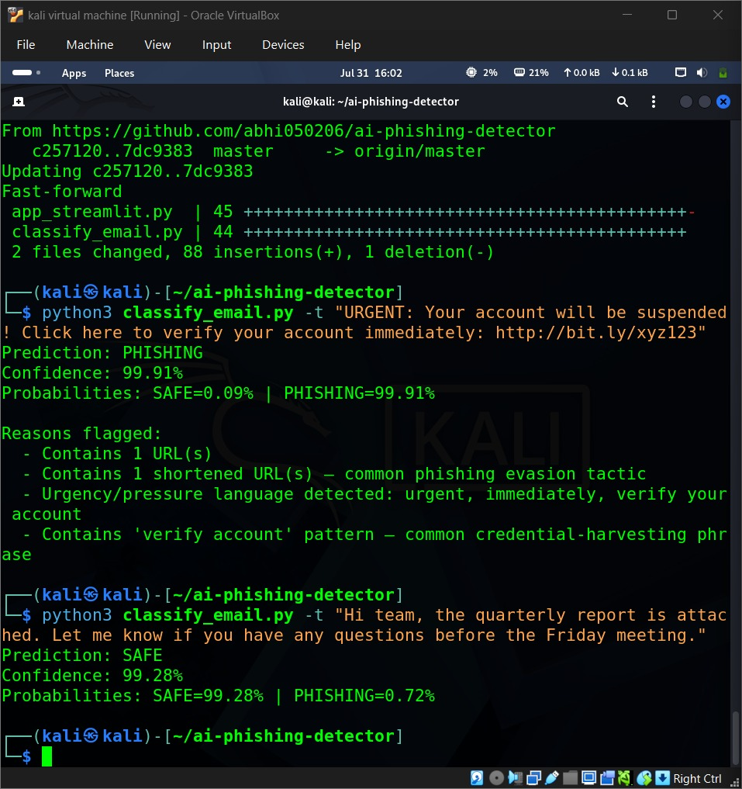

# AI Phishing Email Detector

A machine learning-based phishing email classifier trained on 82,000+ real emails.

## Overview
This project uses TF-IDF vectorization + Logistic Regression to classify emails as phishing or safe. Trained on a combined dataset of Enron, Ling, CEAS, Nazario, Nigerian Fraud, and SpamAssassin email corpora.

## Results
- Dataset size: 82,486 emails (combined Enron, Ling, CEAS, Nazario, Nigerian Fraud, SpamAssassin corpora)
- Test accuracy: 98.2%
- Precision/Recall/F1: 0.98 across both classes (balanced performance — not skewed toward one class)

**Note:** High accuracy on these well-known public corpora doesn't guarantee equivalent real-world performance on novel phishing campaigns — the model may not generalize to attack patterns absent from the training corpora. False positives (legitimate emails flagged as phishing) and false negatives (missed phishing) both carry real cost in a SOC context, so this tool is best used as a triage aid, not a fully automated blocker.

## Explainability
Beyond the raw prediction, the tool flags **specific reasons** behind a classification — URL count, shortened-link detection, urgency/pressure language, credential-harvesting phrases (e.g. "verify account"), and excessive punctuation. These heuristics are not arbitrary — they mirror the same numeric signals (`extract_numeric_features` in `feature_utils.py`) the model itself uses alongside TF-IDF during training, so the explanation reflects what the classifier is actually keyed on rather than an unrelated post-hoc justification.

**Phishing example (flagged reasons) vs. Safe example (no reasons flagged):**

## Files
- `train_phishing.py` — trains the model on `phishing_email.csv`
- `classify_email.py` — CLI tool to classify a single email
- `app_streamlit.py` — Streamlit web demo
- `feature_utils.py` — shared feature extraction (URL count, urgency-keyword count) used by both training and inference
- `phishing_model.joblib` — trained model (generated after running train_phishing.py, not included in repo)

## Setup

Install dependencies:

    pip install pandas scikit-learn joblib streamlit

Download the dataset from Kaggle: Phishing Email Dataset. Place `phishing_email.csv` in the project directory.

## Usage

Train the model:

    python3 train_phishing.py

Classify an email via CLI:

    python3 classify_email.py -t "Your email text here"

Run the web demo:

    streamlit run app_streamlit.py

## About
An AI-powered phishing email detection system built with Python and scikit-learn. The project uses natural language processing (TF-IDF) and machine learning (Logistic Regression) to identify suspicious emails with high accuracy. Features include a CLI tool for quick classification, an interactive web interface for demonstrations, and reason-level explainability tied to the model's actual input features.
